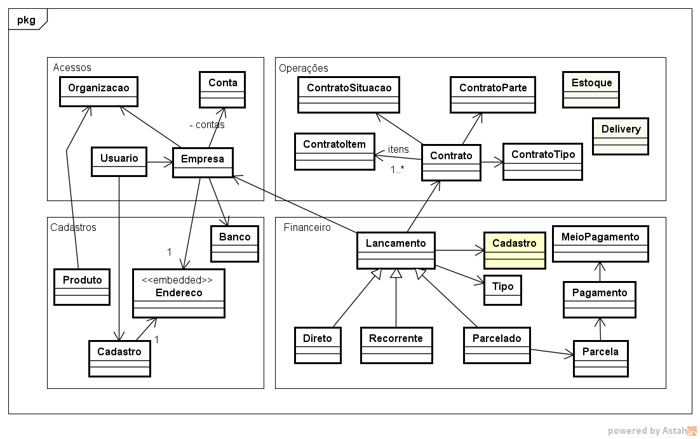
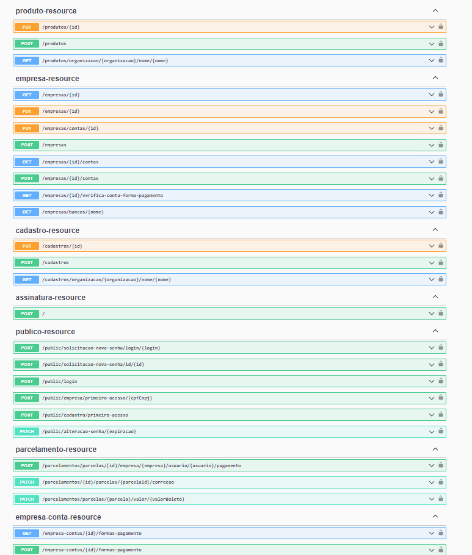

# Digytal - Programação, Pesquisa e Educação
[www.digytal.com.br](http://www.digytal.com.br)

[(11) 95894-0362](https://api.whatsapp.com/send?phone=5511958940362)

#### Autores
- [Gleyson Sampaio](https://github.com/glysns)

## Control BackEnd 

Esta é uma API Desenvolvida em SpringBoot para prover recursos de gestão empresarial

### Tecnologias

* Java 1.8+
* SpringBoot 2.7.4
* SpringDataJpa
* Hibernate
* SpringWeb
* SpringSecurity
* JWT
* SpringTest
* Projeto Lombok
* Postgres database
* Swagger OpenAPI
* Spring Email
* RestTemplate
* Asaas Boleto
* Flyway
* Spring Scheduling

### Dependências

Um projeto SpringBoot é formado por dependência denominadas de **starters** e o nosso projeto por ser uma API Rest especificamente utilizará os starters citados no `pom.xml`

```xml
<dependency>
    <groupId>org.springframework.boot</groupId>
    <artifactId>spring-boot-starter-test</artifactId>
    <scope>test</scope>
</dependency>

<dependency>
    <groupId>org.springframework.boot</groupId>
    <artifactId>spring-boot-starter-data-jpa</artifactId>
</dependency>

<dependency>
    <groupId>org.springframework.boot</groupId>
    <artifactId>spring-boot-starter-web</artifactId>
</dependency>
```

#### Projeto Lombok

O Lombok é uma biblioteca Java focada em produtividade e redução de código boilerplate que, por meio de anotações adicionadas ao nosso código, ensinamos o compilador (maven ou gradle) durante o processo de compilação a criar código Java.

```xml
<dependency>
    <groupId>org.projectlombok</groupId>
    <artifactId>lombok</artifactId>
    <version>1.18.24</version>
    <scope>provided</scope>
</dependency>
```

>O projeto está utilizando

#### Persistência de dados

O SpringBoot é facilmente configurável a qualquer provedor de acesso a dados como H2 Database, PostgreSQL, MySQL, SQLServer, Oracle Database entre outros, basta informar a biblioteca correspondente e configurar a sua conexão de bancos de dados no arquivo `resources/application.properties`.

* Configurando o banco de sua preferência


#### **`application.properties`**


#### Documentação da API

O Swagger é um framework composto por diversas ferramentas que, independente da linguagem, auxilia a descrição, consumo e visualização de serviços de uma API REST.

```xml
<dependency>
    <groupId>org.springdoc</groupId>
    <artifactId>springdoc-openapi-ui</artifactId>
    <version>1.6.4</version>
</dependency>
```

Ao iniciar o seu projeto, acesse a documentação do sua aplicação através do link: `http://localhost:8080/swagger-ui/index.html`

### Estrutura do projeto

O projeto é composto por pacotes que classificam as classes de acordo com o seu papel ou finalidades específicas.

O pacote principal é `com.digytal.control`.

| Nome       | Descrição                                                                                  |
|------------|--------------------------------------------------------------------------------------------|
| infra      | pacote que contém classes de infraestrutura                                                |
| integracao | pacote que contém as classes de integradoras                                               |
| job        | rotinas spring scheduller + cron                                                           |
| service    | pacote que contém as classes responsáveis por gerenciar as regras de negóicio da aplicação |
| webservice | pacote que contém as classes que representam os recursos https disponíveis pela aplicação  |

### Model

As aplicações costumam separar a camada de domínio (Entity) com a camada de transferência de dados (DTO) para manter a segurança no que se refere ao acesso à dados.
Para implementar nosso projeto seguindo esta diretriz, organizamos a nossa camada de modelo contendo três arquivos comuns para cada entidade da aplicação.

* Entity - Classe mapeada com JPA para representar uma tabela no banco de dados
* Request - Classe que será utilizada para realizar operações de inclusão e alteração de registros
* Response - Classe que representa a resposta no formato JSon das consultas realizadas pela aplicação.

### Executando a aplicação

Para executar a aplicação é simples, basta abrir a classe `ControlApiApplication` e ativar  `run` ou `debug` em sua IDE.

Estando tudo certinho conforme log abaixo, basta acessar o link: `http://localhost:8080/swagger-ui/index.html`

```shell
2023-04-08 13:08:56.368  INFO 20680 --- [           main] o.s.b.w.embedded.tomcat.TomcatWebServer  : Tomcat started on port(s): 8080 (http) with context path ''
2023-04-08 13:08:56.375  INFO 20680 --- [           main] d.b.api.SpringbootCrudApiApplication     : Started SpringbootCrudApiApplication in 3.096 seconds (JVM running for 4.029)
2023-04-08 13:09:00.612  INFO 20680 --- [nio-8080-exec-1] o.a.c.c.C.[Tomcat].[localhost].[/]       : Initializing Spring DispatcherServlet 'dispatcherServlet'
2023-04-08 13:09:00.612  INFO 20680 --- [nio-8080-exec-1] o.s.web.servlet.DispatcherServlet        : Initializing Servlet 'dispatcherServlet'
2023-04-08 13:09:00.613  INFO 20680 --- [nio-8080-exec-1] o.s.web.servlet.DispatcherServlet        : Completed initialization in 1 ms
2023-04-08 13:09:01.196  INFO 20680 --- [nio-8080-exec-4] o.springdoc.api.AbstractOpenApiResource  : Init duration for springdoc-openapi is: 299 ms
```

### UML



### Swagger


